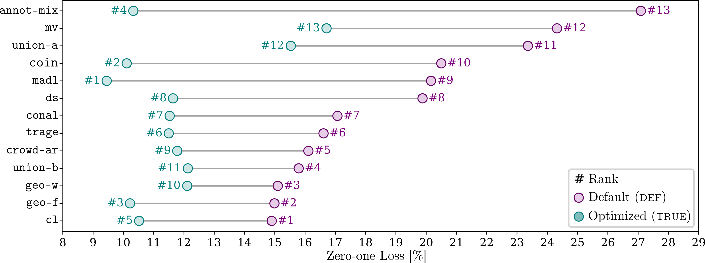

# `crowd-hpo`: Realistic Hyperparameter Optimization and Benchmarking for Learning from Crowds with Noisy Labels :gear:
<a href="https://pytorch.org/get-started/locally/"></a>
<a href="https://www.pytorchlightning.ai/"></a>
<a href="https://hydra.cc/"></a>

This project provides the codebase associated with the paper
> Anonymous. crowd-hpo: Realistic Hyperparameter Optimization and
> Benchmarking for Learning from Crowds with Noisy Labels. Under Review at TMLR. 2025.

<div align="left">
  
</div>

**Motivation:** 
- Default (DEF): Benchmarking learning from crowds approaches with default hyperparameters is realistic but leads to an unfair comparison of suboptimal performances.
- Default (TRUE): Benchmarking learning from crowds approaches with hyperparameters optimized via a validation set with ground truth class labels leads to a fair comparison with much better performances but is unrealistic.
- Both benchmarks lead to different rankings of the learning from crowds approaches.

**Goal:** Enable a fairer and more realistic benchmark of learning from crowds approaches by optimizing their hyperparameters with access only to crowd-labeled training and validation data.

## Setup of Conda Environment :snake:
As a prerequisite, we assume that we have a Linux distribution as an operating system. 

1. Download a [`conda`](https://conda.io/projects/conda/en/latest/user-guide/install/index.html) version to be installed on your machine. 
2. Set up the environment via
```bash
projectpath$ conda env create -f environment.yml
```
As a fallback in the case of any issues with the previous installation, we also provie a 
[`requirements.txt`](requirements.txt) file, which lists all manually installed Python packages:
```bash
projectpath$ conda create -n crowd-hpo python=3.9
projectpath$ conda activate crowd-hpo
projectpath$ pip install -r requirements.txt
```
In both cases, keep in mind to adjust the [`torch`](https://pytorch.org/get-started/locally/) related packages
according to your hardware.
3. Activate the new environment
```bash
projectpath$ conda activate crowd-hpo
```
4. Verify that the `crowd-hpo` environment was installed correctly:
```bash
projectpath$ conda env list
```

## Structure :classical_building:
- [`empirical_evaluation`](empirical_evaluation): scripts to reproduce or adjust our benchmark study
  - [`hydra_configs`](empirical_evaluation/hydra_configs): collection of [`hydra`](https://hydra.cc/docs/intro/) config files for defining hyperparameters
    - [`architecture`](empirical_evaluation/hydra_configs/architecture): config group of config files for neural network architectures
    - [`classifier`](empirical_evaluation/hydra_configs/classifier): config group of config files for learning from crowds approaches
    - [`data`](empirical_evaluation/hydra_configs/data): config group of config files for datasets
    - [`ssl_model`](empirical_evaluation/hydra_configs/ssl_model): config group of config files for self-supervised learning models as backbones
    - [`experiment.yaml`](empirical_evaluation/hydra_configs/experiment.yaml): config file to define the architecture(s), dataset, and learning from crowds approach for an experiment
  - [`jupyter_notebooks`](empirical_evaluation/jupyter_notebooks): Jupyter notebooks to analyze results or use cases
    - [`analyze_results.ipynb`](empirical_evaluation/jupyter_notebooks/analyze_results.ipynb): Jupyter notebook to visualize all results obtained after executing the experiments
  - [`python_scripts`](empirical_evaluation/python_scripts): collection of scripts to perform experimental evaluation
    - [`perform_experiments.py`](empirical_evaluation/python_scripts/perform_experiments.py): script to execute a single experiment for a given configuration
    - [`write_bash_scripts.py`](empirical_evaluation/python_scripts/write_bash_scripts.py): script to write Bash or Slurm scripts for evaluation
- [`maml`](maml): Python package for learning from crowds, consisting of several sub-packages
    - [`architectures`](maml/architectures): implementations of network architectures for the data classification, crowdworker classification, and crowdworker performance models
    - [`classifiers`](maml/classifiers): implementations of learning from crowds approaches using [`pytorch_lightning`](https://www.pytorchlightning.ai/) modules
    - [`data`](maml/data): implementations of [`pytorch`](https://pytorch.org/) datasets with class labels from noisy crowdworkers
    - [`utils`](maml/utils): helper functions, e.g., for visualization
- [`environment.yml`](environment.yml): file containing all package details to create a [`conda`](https://conda.io/projects/conda/en/latest/) environment

## Experimental Study :bar_chart:

We provide scripts and a Jupyter notebook to benchmark and visualize learning from crowds approaches in combination
with hyperparameter optimization with crowd-labeled validation data on real-world dataset variants labeled by noisy 
human crowdworkers. 

### Experiments 
The Python script for executing a single experiment is 
[`perform_experiment.py`](empirical_evaluation/python_scripts/perform_experiment.py) and the corresponding main config file 
is [`evaluation`](empirical_evaluation/hydra_configs/experiment.yaml). In this config file, you also need to specify the `mlruns_path` 
defining the path, where the results are to be saved via [`mlflow`](https://mlflow.org/). Further, you have the option
to select the 'gpu' or 'cpu' as `accelerator`.
1. Before starting a single experiment or Jupyter notebook, check whether all datasets are already downloaded. 
For example, if you want to ensure that the dataset `music_genres` is downloaded, update the `download` flag in its config 
file [`music_genres.yaml`](empirical_evaluation/hydra_configs/data/music_genres.yaml).
2. An experiment can then be started by executing the following commands
```bash
projectpath$ conda activate crowd-hpo
projectpath$ cd empirical_evaluation/python_scripts
projectpath/empirical_evaluation/python_scripts$ python perform_experiment.py \
    data=music_genres \
    data.class_definition.variant="full" \
    classifier=coin_net \
    seed=0 \
    data.class_definition.download=True \
    architecture=tabnet_music_genres \
    ssl_model=none
````
3. Since there are many different experimental configurations, including five repetitions with different seeds, you can
create Bash scripts by following the instructions in [`write_bash_scripts.py`](empirical_evaluation/python_scripts/write_bash_scripts.py) and then
execute the following commands
```bash
projectpath$ conda activate crowd-hpo
projectpath$ cd empirical_evaluation/python_scripts
projectpath/empirical_evaluation/python_scripts$ python write_bash_scripts.py
```
4. There is a bash script for the HPS, the default data-agnostic HPC, and the default data-specific HPC for each dataset variant of the benchmark. For 
example, executing the HPS for the dataset variant `mgc-full` via SLURM can be done according to
```bash
projectpath$ conda activate crowd-hpo
projectpath$ sbatch path_to_bash_scripts/hyperparameter_search_music_genres_full_part1.sh
projectpath$ sbatch path_to_bash_scripts/hyperparameter_search_music_genres_full_part2.sh
projectpath$ sbatch path_to_bash_scripts/hyperparameter_search_music_genres_full_part3.sh
projectpath$ sbatch path_to_bash_scripts/hyperparameter_search_music_genres_full_part4.sh
```

### Results
Once all experiments are completed, their associated results can be loaded via [`mlflow`](https://mlflow.org/). 
To get a full presentation of these results, you need to start the Jupyter notebook 
[`analyze_results.ipynb`](empirical_evaluation/jupyter_notebooks/analyze_results.ipynb) and follow its instructions.
```bash
projectpath$ conda activate crowd-hpo
projectpath$ cd empirical_evaluation/jupyter_notebooks
projectpath/empirical_evaluation/jupyter_notebooks$ jupyter-notebook analyze_results.ipynb
```

## Trouble Shooting :rotating_light:
If you encounter any problems, watch out for any `TODO` comments, which give hints or instructions to ensure the 
functionality of the code. If the problems are still not resolved, feel free to create a corresponding GitHub issue
or contact us directly via the e-mail [anonymous@anonymous.com](mailto:anonymous@anonymous.com)
